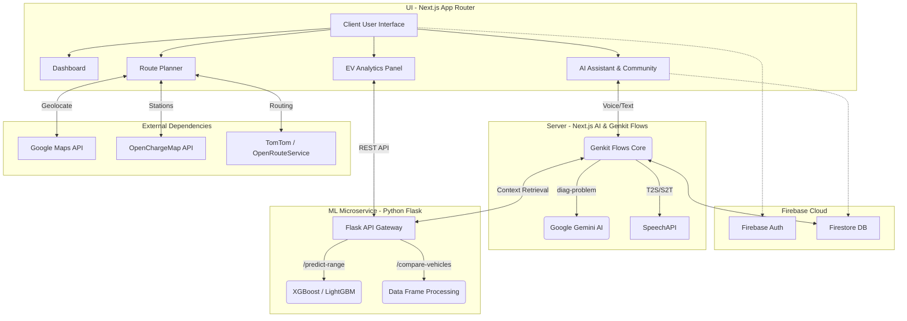

# MoveOnEV - Comprehensive Project Documentation

## 1. Executive Summary
MoveOnEV is a full-fledged Progressive Web Application (PWA) designed to serve as an all-in-one digital companion for Electric Vehicle (EV) owners in India. It consolidates multiple scattered functionalities into a single, cohesive portal—enabling high-accuracy EV range predictions, an AI-powered vehicle assistant, intelligent route planning with charging stops, vehicle analytics, and a community hub. 

The application utilizes a distributed microservices architecture consisting of a **Next.js 15 PWA frontend/backend (Server Components)** and an independent **Python 3 Flask Machine Learning Service**. Interaction orchestration happens via Google Genkit flows, pulling data from Firestore, Google Maps, OpenChargeMap, and the internal ML engine.

---

## 2. Problem Definition & Market Need
The EV landscape currently suffers from a highly fragmented digital ecosystem resulting in:
- **Severe Range Anxiety:** Drivers fear battery depletion mid-route without accurate prediction tools or known charging stop intervals.
- **Fragmented Tools:** Users employ separate apps for maps, charging stations, forums, and diagnostics.
- **Lack of Trusted Support:** Discovering EV-certified service centers remains difficult.
- **Missing Peer Network:** No dedicated native hub for EV enthusiasts to interact and share tips.
MoveOnEV addresses these by merging maps, real-time ML range predictions, EV diagnostics, and a social platform.

---

## 3. Technology Stack & Core Infrastructure

### Frontend Architecture (PWA)
- **Framework:** Next.js 15 App Router (`src/app/`)
- **Render Engine:** React 18, utilizing React Server Components & client hooks
- **Styling:** Tailwind CSS with comprehensive custom `shadcn/ui` components
- **State/Form Management:** React Hook Form + Zod, Recharts (for data visualization)
- **Map Integration:** Google Maps (`@react-google-maps/api`)
- **Routing & Types:** TypeScript with `strict` mode constraints.

### Backend & AI Orchestration (`src/ai/`)
- **Database / Auth / Hosting:** Firebase Authentication, Firestore Database.
- **AI Engine:** Google Genkit flows driving Google AI Models (Gemini). Contains explicit, modular AI actions:
  - `diagnose-problem.ts`: Diagnoses EV issues based on conversational or audio input.
  - `find-charging-stations.ts` & `find-service-centers.ts`: Geo-spatial searches.
  - `suggest-charging-stops.ts`: Intelligent route calculation considering battery levels.
  - `getCommunityPosts.ts` & `addCommunityPost.ts`: Managed Firestore interactions.
  - `text-to-speech.ts` & `transcribe-audio.ts`: Handling bilingual voice inputs.

### Data Science / Machine Learning Service (`backend/ml-service/`)
- **Core Server:** Python 3 + Flask.
- **Models Used:** XGBoost, LightGBM, Random Forest, Gradient Boosting Regressor (an ensemble Voting Regressor ranks best).
- **Libraries:** Scikit-learn, Pandas, NumPy, Joblib.
- **Data Engineering:** Ingests EV technical data handling features such as `Battery_Capacity_kWh`, `Energy_Consumption_kWh_per_100km`, `Avg_Speed_kmh`, and `Temperature_C`. 
- **Caching & Preprocessing:** Flask-Caching is executed. Missing data is imputed; categories are one-hot encoded; continuous variables are scaled.

---

## 4. Comprehensive Feature Overview

### 4.1 Intelligent Route Planner
Uses OpenRouteService/TomTom, taking traffic density into account. Generates optimized waypoints based on the user's specific EV model, initial state of charge, and charging network locations.

### 4.2 AI Vehicle Assistant
An intelligent Genkit-bot capable of accepting English and Hindi voice inputs. Assesses fault descriptions and produces immediate troubleshooting steps alongside relevant repair video resources. 

### 4.3 Advanced EV Analytics Suite
Powered exclusively by the ML microservice.
*   **Ideal Range Predictor:** Baseline WLTP matching.
*   **Real-World Predictor:** Adjusts for battery degradation (SoH), HVAC usage, ambient temperature, and intended average speed—drastically reducing range anxiety by giving accurate estimations.
*   **Efficiency Leaderboard & Comparison Tool:** Benchmarks up to 3 individual vehicles side-by-side using an extensive aggregated dataset (`open-ev-data` + `electric_vehicle_analytics`).

### 4.4 Community & Rewards Flow
A forum mechanism backed by Firestore ensuring users can foster a network. Gamified logging (recording trips and utilizing green driving configurations) generates rewards mimicking carbon emission savings.

---

## 5. Architectural Diagram



---

## 6. Directory Structure Mapping

```text
MoveOnEV-main/
├── src/
│   ├── app/                    # High-level Next.js app router 
│   │   ├── (main)/             # Protected UI routes (analytics, dashboard, planner, stations, etc)
│   │   ├── api/                # Any Next.js server-side endpoint configurations
│   │   ├── login/              # Firebase-backed auth portal
│   │   ├── layout.tsx          # Master layout configuration
│   ├── ai/                     # Genkit Infrastructure
│   │   ├── flows/              # Distinct functional endpoints (e.g. diagnose-problem.ts, addCommunityPost.ts)
│   │   └── genkit.ts           # Genkit setup and plugin initializations
│   ├── components/             # Reusable UI Elements split organically
│   │   ├── community/          
│   │   ├── ev-analytics/       
│   │   ├── layout/             
│   │   └── ui/                 # Core ShadCN definitions
│   ├── lib/                    # Helper singletons, typings, and constants
│   └── hooks/                  # React custom hooks
├── backend/
│   └── ml-service/             # Dedicated Data Science environment
│       ├── app.py              # Main Flask orchestration (holds the EVRangePredictor class)
│       ├── models/             # Pickled machine learning pipelines (e.g., ensemble_model.pkl)
│       ├── data/               # Aggregated CSVs
│       └── requirements.txt    # Dedicated env definitions
├── .env.local                  # Critical application secrets
├── tailwind.config.ts          # Core styling parameters
└── package.json                # Project dependencies
```

---

## 7. Machine Learning (Flask) API Specification

The ML backend (`localhost:5000` locally) serves the following interfaces to the Next.js framework:

1. **`POST /predict-range`**
   - Implements hardware specs predictions natively. 
   - Payload: `{"battery_capacity_kWh": number, "efficiency_wh_per_km": number, ...}`
   - Pipeline executed: Fills NaNs, Standard Scaler, feeds into VotingRegressor.
2. **`POST /predict-real-world-range`**
   - Applies complex conditions to base hardware specifications to output dynamic driving limitations.
   - Payload: `{"Battery_Capacity_kWh": number, "Battery_Health_Percent": number, "Avg_Speed_kmh": number, "Temperature_C": number, ...}`
3. **`GET /efficiency-rankings`**
   - Accesses unified pandas dataframes, cleans anomalies, interpolates gaps, sorts by efficiency heuristics, and outputs top sets.
4. **`POST /compare-vehicles`**
   - Performs side-by-side spec alignment formatting based on `{"vehicleNames": [...]}` arrays.
5. **`GET /search-vehicles`**
   - Serves query capabilities mapping parameter filters to the resident data store.

---

## 8. Deployment Flow

**Frontend & Serverless Architecture:**
- Pinned to run predominantly via Vercel ensuring the Next.js App Router API nodes execute effectively in serverless capacities.
- Environmental variables inject keys for routing services and pointing to the external ML endpoints.

**Machine Learning Backend:**
- Runs as a containerized persistent service (GCP Cloud Run / equivalent via Python WSGI endpoints). Due to memory structures housing loaded multi-ensemble scikit/lightGBM models in RAM via joblib, persistent instances improve latency markedly over cold-start lambdas.

---

## 9. Security & Scalability Characteristics
- **JWT Binding:** Authenticated state rests on Firebase Auth ensuring only validated EV profiles can post to community boards or execute heavy ML processes.
- **Model Modularity:** Because the Next.js app communicates over REST with the Flask app, swapping model schemas or adding heavy Deep Learning inferences in the future will not drag frontend compilation times.
- **Data Extensibility:** The `app.py` script possesses intelligent matching arrays `normalize_prediction_input()` that handle minor spelling deviations or casing mismatches stemming from differently sourced EV datasets (like `open-ev-data`). 

## 10. Recommended Future Iterations
1. Transitioning to Native Environments: With an established REST ML service and Genkit flows, transferring the Next.js code to **React Native/Expo** or wrapping it with **Capacitor** is a highly viable direct next step for app stores.
2. Direct ODB-II Implementations: Using Bluetooth OBD2 scanners natively connected to devices to feed live telemetry straight into the `/predict-real-world-range` system dynamically.
